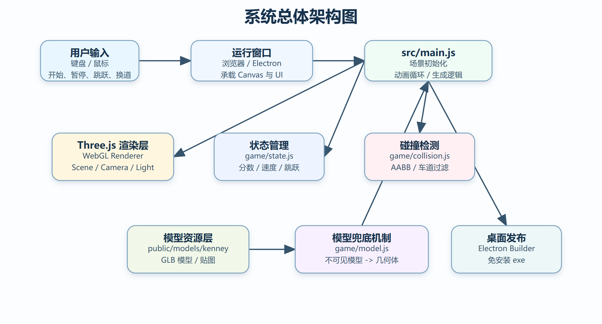
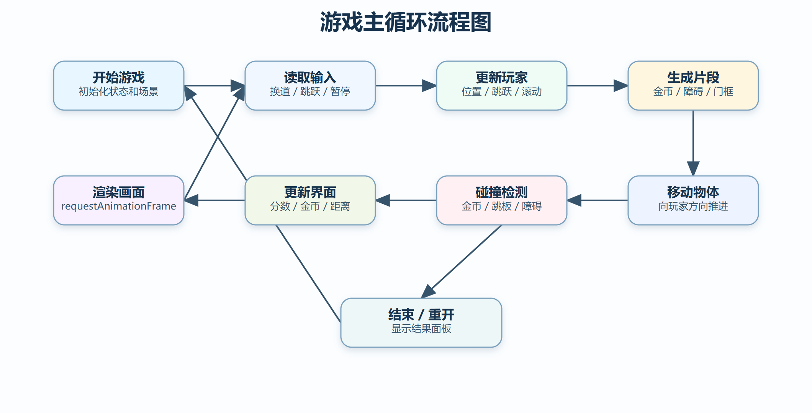
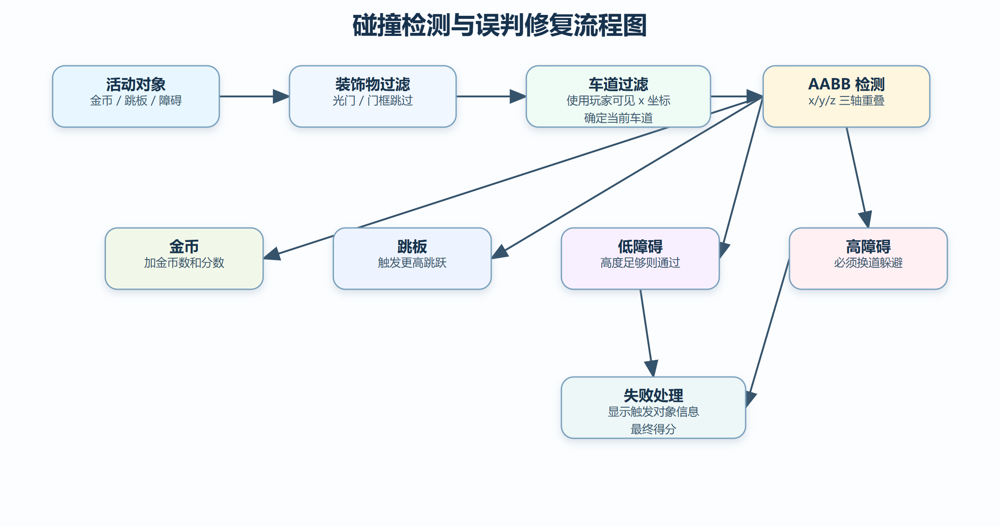
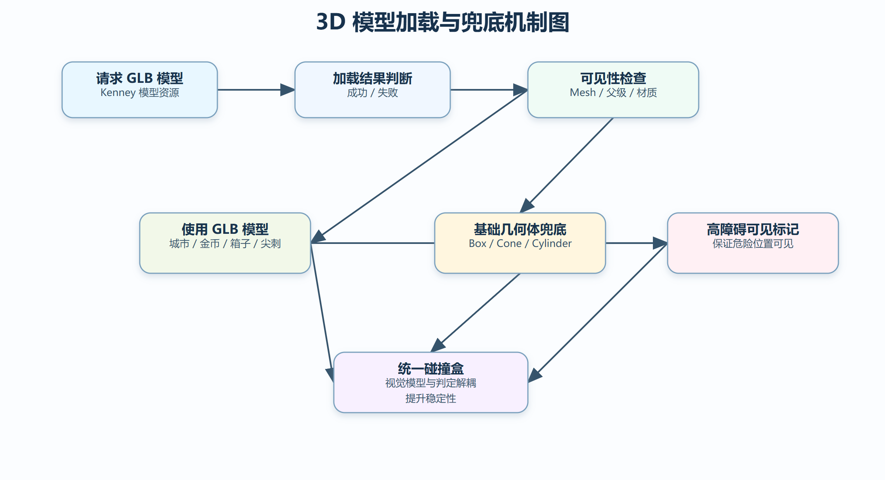
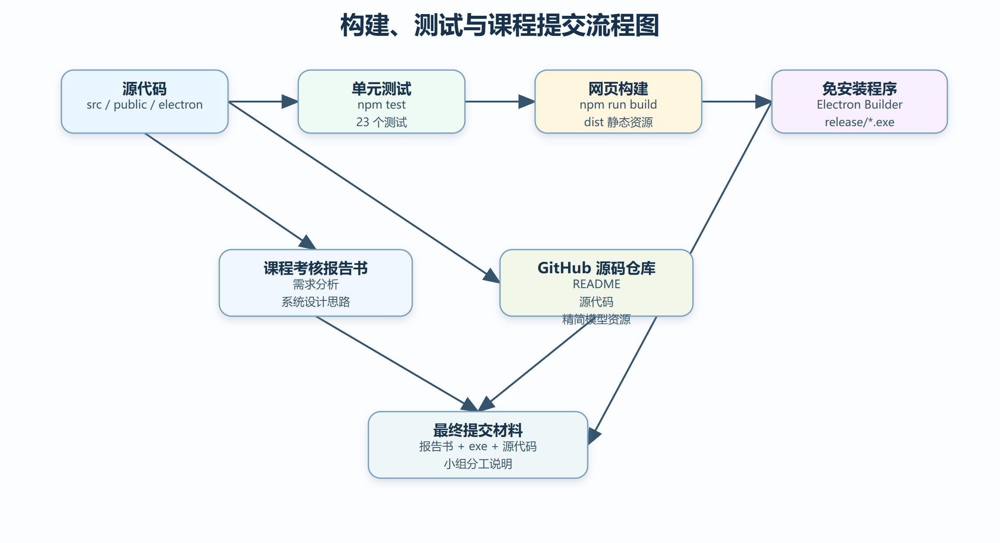

# 基于 WebGL 与 Three.js 的三维跑酷游戏设计与实现

## 1. 项目概述

### 1.1 项目名称

霓虹金币跑酷

### 1.2 项目类型

作品设计型课程实践项目，作品形式为网页三维游戏，并已打包为 Windows 免安装可执行程序。

### 1.3 项目简介

本项目是一个基于 WebGL 与 Three.js 实现的 3D 跑酷收集金币小游戏。玩家控制一个霓虹小球在三条悬浮赛道之间移动和跳跃，通过收集金币获得分数，同时需要躲避高障碍、越过低障碍，并在速度逐渐提升的过程中尽可能获得更高分数。

项目采用网页三维游戏的技术路线，使用 Three.js 完成三维场景渲染、模型加载、灯光、雾效、粒子效果和动画表现；使用 JavaScript 实现游戏状态管理、关卡片段生成、碰撞检测、得分统计和用户交互；使用 Electron 将网页游戏打包为 Windows 免安装可执行程序，便于课程提交和展示。

【截图：游戏开始界面】

### 1.4 与课程考核要求的对应关系

| 课程考核要求 | 本项目对应情况 | 是否满足 |
|---|---|---|
| 作品设计题目需与多媒体课程相关 | 项目包含 3D 场景、模型、动画、音效、交互和 UI，属于网页三维游戏 | 满足 |
| 可以选择网页三维游戏或手机游戏等作品 | 本项目为基于 WebGL/Three.js 的网页三维跑酷游戏 | 满足 |
| 提交课程考核报告书 | 本文档即课程考核报告书，包含需求分析、系统设计思路、关键技术和测试说明 | 满足 |
| 提交系统安装程序或可执行文件 | 项目已通过 Electron Builder 打包为 `霓虹金币跑酷-免安装版-1.0.0.exe` | 满足 |
| 提交源代码 | 源代码已整理到项目目录，并上传至 GitHub 仓库 | 满足 |
| 小组完成需说明成员分工和工作量 | 报告第 11 节提供个人/小组分工说明表，可按实际情况填写 | 满足 |

### 1.5 项目目标

本项目的主要目标如下：

- 实现一个可交互的 3D 跑酷小游戏；
- 展示 Three.js 在网页三维场景中的应用；
- 体现多媒体课程中的三维图形、动画、交互、音效和模型资源整合；
- 支持浏览器运行和 Windows 免安装版运行；
- 保持游戏规则清晰、画面完整、操作简单，便于课堂展示和验收；
- 提供完整源码、可执行程序和实验报告，满足课程提交要求。

## 2. 需求分析

### 2.1 功能需求

本游戏需要完成以下功能：

| 功能类别 | 功能说明 |
|---|---|
| 玩家控制 | 支持左右换道和跳跃操作 |
| 场景渲染 | 显示三维赛道、城市建筑、星空背景、灯光和雾效 |
| 金币系统 | 生成金币，玩家碰到金币后增加金币数和分数 |
| 障碍系统 | 生成高障碍、低障碍、跳跃障碍、光门和门框组合 |
| 碰撞检测 | 判断玩家是否收集金币、踩到跳板或撞到障碍 |
| 速度变化 | 游戏速度随时间逐渐提高 |
| UI 显示 | 显示分数、金币数、历史最高分和前进距离 |
| 游戏状态 | 支持开始、暂停、继续、失败、重新开始 |
| 模型加载 | 加载 Kenney 3D 模型，并在模型异常时使用几何体兜底 |
| 桌面打包 | 使用 Electron 打包为 Windows 免安装可执行程序 |

### 2.2 非功能需求

本项目还需要满足以下非功能需求：

- 游戏运行流畅，基础操作响应及时；
- 视觉元素与碰撞判定尽量一致，避免“空气碰撞”；
- 模型资源加载失败时游戏仍然可运行；
- 代码结构清晰，核心逻辑可测试；
- 项目可以通过 `npm install`、`npm run dev`、`npm run build` 等命令复现运行；
- 可执行文件能够在 Windows 环境下双击运行；
- 源代码、模型资源、构建脚本和报告文档结构清晰，便于验收。

### 2.3 用户操作需求

| 操作 | 按键 |
|---|---|
| 左移 | `A` / `←` |
| 右移 | `D` / `→` |
| 跳跃 | `Space` / `W` / `↑` |
| 暂停或继续 | `P` |
| 重新开始 | `R` |

【截图：游戏运行界面，展示 HUD 分数、金币、距离】

## 3. 系统总体设计

### 3.1 技术路线

项目采用 Vite + Three.js + JavaScript + Electron 的技术路线。其中：

- Vite 用于前端开发服务器和生产构建；
- Three.js 用于 WebGL 三维场景渲染；
- JavaScript 用于游戏逻辑、交互控制和状态管理；
- Vitest 用于核心逻辑单元测试；
- Playwright 用于浏览器端运行检查；
- Electron 和 Electron Builder 用于打包 Windows 免安装程序。

### 3.2 系统总体架构



图 1 系统总体架构图。

系统总体上分为输入层、运行窗口层、游戏主逻辑层、渲染层、游戏规则层、模型资源层和打包发布层。用户通过键盘进行操作，浏览器或 Electron 窗口承载 Canvas 和 UI，`src/main.js` 负责场景初始化、动画循环和关卡生成，`game/state.js`、`game/collision.js`、`game/model.js` 分别负责状态、碰撞和模型兜底逻辑。

### 3.3 项目目录结构

```text
3d-runner-coin-game/
├─ electron/              # Electron 主进程入口
├─ public/models/         # 游戏运行需要的精简 3D 模型资源
├─ scripts/               # Windows 打包脚本
├─ src/
│  ├─ game/               # 状态、碰撞、模型辅助函数与测试
│  ├─ main.js             # Three.js 场景、渲染循环、生成逻辑
│  └─ styles.css          # 页面和 HUD 样式
├─ index.html
├─ package.json
├─ vite.config.js
└─ README.md
```

## 4. 游戏流程设计

### 4.1 游戏主流程

游戏启动后首先显示开始界面。玩家点击开始后，系统初始化场景对象和游戏状态，然后进入主循环。主循环中不断更新玩家运动、跳跃状态、关卡片段、物体位置、碰撞检测和 UI 数据。当玩家撞到不可通过的障碍物时，游戏结束并显示最终得分。



图 2 游戏主循环流程图。

### 4.2 游戏状态设计

游戏状态主要包括：

- `status`：当前状态，包括 ready、running、paused、ended；
- `laneIndex` 与 `targetLaneIndex`：当前车道和目标车道；
- `score`：当前分数；
- `coins`：金币数量；
- `bestScore`：历史最高分；
- `speed`：当前前进速度；
- `elapsed`：游戏运行时间；
- `playerY`：玩家垂直位置；
- `verticalVelocity`：跳跃速度；
- `isGrounded`：是否在地面上。

状态变化主要分为：准备状态、运行状态、暂停状态和结束状态。玩家点击开始进入运行状态，运行中可暂停或继续，撞到障碍后进入结束状态，重新开始后再次进入运行状态。

## 5. 功能模块设计

### 5.1 三维场景模块

三维场景由 Three.js 创建，包括相机、渲染器、灯光、玩家小球、赛道、金币、障碍物、城市建筑和粒子背景。项目使用透视相机展示跑酷方向上的深度感，同时使用雾效和星空背景增强三维空间感。

【截图：三维赛道和城市建筑背景】

### 5.2 玩家控制模块

玩家通过键盘控制小球在三条赛道之间移动。左右移动使用目标车道和阻尼插值实现，使小球在画面中平滑移动；跳跃使用重力和垂直速度模拟，实现向上跳起和落回赛道的过程。

### 5.3 关卡片段生成模块

地图不是完全随机生成，而是由固定的关卡片段循环生成。当前关卡片段包括：

- 跳跃组合；
- 金币串；
- 低障碍；
- 门框障碍；
- 光门；
- 空中金币；
- 跳板。

部分外观模型会随机选择，例如高障碍可能显示为箱子或尖刺，城市建筑也会随机选择不同模型。这样既保证了关卡规则可控，又能避免视觉过于重复。

【截图：金币串】

【截图：跳跃障碍和跳台】

【截图：门框障碍，展示安全车道和危险车道】

### 5.4 碰撞检测模块

项目使用 AABB 包围盒进行碰撞检测。每个可碰撞对象都有 `boxSize` 和可选的 `boxCenterOffset`。玩家小球也会被转换为一个简化碰撞盒，用于和金币、跳板、障碍物进行检测。

为了减少误判，项目做了以下处理：

- 装饰物和光门不参与碰撞；
- 单车道物体只和玩家当前可见车道进行碰撞；
- 低障碍和跳跃障碍在玩家高度足够时可以越过；
- 高障碍不能跳过，只能换道躲避；
- 模型不可见时不直接使用该模型，改为基础几何体兜底；
- 高障碍额外增加可见标记，保证有碰撞的位置一定有可见实体。



图 3 碰撞检测与误判修复流程图。

### 5.5 模型资源与兜底模块

项目使用 Kenney 免费 3D 模型资源，包括城市建筑、金币、箱子、尖刺、栅栏和平台。模型文件放在 `public/models/kenney/` 下，运行时通过 `GLTFLoader` 加载。

实际开发中发现，模型可能存在加载失败、不可见、材质不可见等情况。如果直接使用不可见模型，会出现“看起来没有障碍但实际发生碰撞”的问题。因此项目实现了模型可见性检查：

- 空 Group 不作为有效模型；
- mesh 隐藏时不作为有效模型；
- 父节点隐藏时不作为有效模型；
- 材质不可见时不作为有效模型；
- 模型无效时退回 Three.js 基础几何体。



图 4 3D 模型加载与兜底机制图。

【截图：Kenney 模型障碍或城市建筑】

### 5.6 UI 与反馈模块

游戏界面上方显示 Score、Coins、Best、Progress 四个指标。中央开始面板用于开始游戏、暂停、重新开始和显示失败原因。金币收集、跳板触发和失败时会产生粒子反馈，并通过音效增强交互感。

【截图：游戏失败界面，展示最终得分和触发信息】

## 6. 关键技术实现

### 6.1 Three.js 场景构建

项目通过 Three.js 创建 `Scene`、`PerspectiveCamera` 和 `WebGLRenderer`，并将渲染器绑定到 HTML Canvas。场景中包含环境光、方向光、点光源、材质、阴影和雾效，使画面具有较强的三维空间感。

### 6.2 玩家移动与跳跃

玩家左右移动不是瞬间切换位置，而是通过目标车道和阻尼函数进行平滑过渡。跳跃部分使用垂直速度和重力模拟，玩家按下跳跃键后获得初始向上速度，随后受重力影响落回地面。

### 6.3 关卡片段循环

关卡生成采用固定片段循环方式。每隔一段时间生成一个片段，并根据当前速度向玩家方向移动。固定片段可以保证游戏节奏稳定，外观随机可以提高视觉变化。

### 6.4 AABB 碰撞检测

碰撞检测使用轴对齐包围盒，分别判断 x、y、z 三个方向上的区间是否重叠。若三个方向都重叠，则认为发生碰撞。该方式计算量小，适合跑酷游戏中大量简单物体的实时检测。

### 6.5 车道过滤与误判修复

在三车道跑酷中，如果只使用目标车道判断碰撞，玩家换道过程中可能出现“球还在左侧，但按中间车道判定撞到障碍”的问题。因此项目根据玩家当前可见 x 坐标计算最近车道，再用于单车道障碍碰撞过滤，使视觉位置和碰撞判定更加一致。

### 6.6 模型加载失败处理

项目中模型资源加载采用“可见性检测 + 几何体兜底”的方式。这样即使模型文件加载失败，游戏仍能显示基础障碍，不会出现隐形障碍。同时，高障碍上会附加一个可见标记，进一步保证危险位置可见。

### 6.7 Electron 打包

项目通过 Electron 将网页游戏打包为桌面程序。Vite 构建网页资源，Electron 主进程加载 `dist/index.html`，Electron Builder 生成 Windows 免安装版 `.exe`。



图 5 构建、测试与课程提交流程图。

【截图：Windows 免安装 exe 文件】

## 7. 系统测试

### 7.1 单元测试

项目使用 Vitest 对核心逻辑进行测试，测试内容包括：

- 游戏初始状态；
- 开始、暂停、结束、重新开始；
- 分数和金币统计；
- 跳跃物理；
- 碰撞盒检测；
- 装饰物过滤；
- 车道过滤；
- 模型可见性判断；
- 模型兜底逻辑。

测试命令：

```bash
npm test
```

【截图：npm test 测试通过结果】

### 7.2 构建测试

项目通过 Vite 进行生产构建：

```bash
npm run build
```

构建成功后会生成 `dist/` 目录。构建过程中 Three.js 相关 JavaScript 文件体积较大，Vite 会给出 chunk size warning，该提示不影响游戏运行。

【截图：npm run build 构建成功结果】

### 7.3 浏览器运行测试

通过浏览器运行游戏，检查以下内容：

- 页面是否正常加载；
- 开始按钮是否可用；
- HUD 是否显示；
- 三维场景是否正常渲染；
- 金币和障碍是否可见；
- 控制台是否存在错误；
- 碰撞和结束面板是否正常。

【截图：浏览器运行测试画面】

### 7.4 免安装版运行测试

通过 Electron Builder 生成 Windows 免安装版后，双击 `.exe` 文件运行，检查游戏是否能在独立窗口中打开并正常开始。

【截图：双击 exe 后打开的游戏窗口】

## 8. 运行与部署

### 8.1 开发环境运行

```bash
npm install
npm run dev
```

### 8.2 生产构建

```bash
npm run build
```

### 8.3 Windows 免安装版打包

```bash
npm run package:win
```

生成结果：

```text
release/霓虹金币跑酷-免安装版-1.0.0.exe
```

由于中文路径下 Electron Builder 可能出现输出目录重命名权限问题，项目提供了 `scripts/package-win.ps1`，该脚本会先将产物输出到 `C:\runner-release`，再复制回项目的 `release/` 目录。

## 9. 最终提交材料说明

根据课程要求，本项目建议提交以下材料：

| 材料 | 当前项目位置 | 说明 |
|---|---|---|
| 课程考核报告书 | `docs/课程设计实验报告.md` | 可转换为 Word 或 PDF 后提交 |
| 系统可执行文件 | `release/霓虹金币跑酷-免安装版-1.0.0.exe` | Windows 免安装版，双击运行 |
| 源代码 | 项目根目录全部源码 | 包含 `src/`、`public/models/`、`electron/`、`scripts/` 等 |
| 运行说明 | `README.md` | 包含本地运行、测试、构建、打包说明 |
| 小组分工说明 | 报告第 11 节 | 按实际成员填写 |

如需提交压缩包，建议结构如下：

```text
课程设计提交材料/
├─ 课程考核报告书.pdf 或 docx
├─ 霓虹金币跑酷-免安装版-1.0.0.exe
├─ 源代码/
│  └─ 3d-runner-coin-game/
└─ 小组分工说明.txt
```

## 10. 项目特色与创新点

本项目的特色主要包括：

1. 使用 WebGL 和 Three.js 实现三维跑酷游戏，不依赖 Unity 等大型游戏引擎；
2. 将网页游戏打包为 Windows 免安装程序，便于展示和提交；
3. 采用固定片段循环和随机外观结合的方式生成关卡；
4. 实现模型可见性检测和几何体兜底机制，提升稳定性；
5. 针对三车道游戏优化碰撞判断，使画面位置和判定逻辑更加一致；
6. 使用自动化测试覆盖核心游戏状态、碰撞和模型辅助逻辑。

## 11. 遇到的问题与解决方法

### 11.1 障碍物视觉与碰撞不一致

开发过程中曾出现玩家看起来没有碰到障碍，但游戏判定失败的情况。分析后发现原因包括模型显示不明显、模型加载失败和换道过程中的车道判定提前变化。

解决方法：

- 对模型进行可见性检查；
- 模型不可见时退回基础几何体；
- 对高障碍添加可见标记；
- 使用玩家当前可见 x 坐标计算碰撞车道，而不是只使用目标车道。

### 11.2 光门与障碍物语义不清晰

早期光门看起来像可以通过的装饰物，但可能参与碰撞，导致玩家误解。后续将光门统一设置为装饰物，不再参与碰撞。真正需要跳跃的障碍改为实体矮墙样式，使视觉表现更符合规则。

### 11.3 Electron 打包路径问题

在中文路径下直接使用 Electron Builder 输出免安装版时，可能出现目录重命名权限错误。解决方法是使用脚本先输出到英文临时目录 `C:\runner-release`，然后再复制到项目 `release/` 目录。

## 12. 小组分工与工作量说明

如果本项目为个人完成，可填写：

| 成员 | 主要工作 | 工作量 |
|---|---|---|
| XXX | 需求分析、游戏设计、Three.js 场景开发、碰撞检测、模型接入、测试、Electron 打包、报告整理 | 100% |

如果为小组完成，可按实际情况修改为：

| 成员 | 主要工作 | 工作量 |
|---|---|---|
| 成员 1 | 需求分析、报告整理、界面截图 | 20% |
| 成员 2 | Three.js 场景与渲染实现 | 25% |
| 成员 3 | 玩家控制、碰撞检测、关卡生成 | 25% |
| 成员 4 | 模型资源整理、UI 与音效 | 15% |
| 成员 5 | 测试、打包、演示材料整理 | 15% |

## 13. 总结与展望

本项目完成了一个基于 Three.js 的 3D 跑酷收集金币小游戏，实现了三维场景渲染、模型加载、角色控制、障碍生成、碰撞检测、分数统计、粒子反馈、音效、UI 状态管理和 Windows 免安装版打包。项目能够较好体现多媒体技术课程中三维图形、交互动画、模型资源整合和软件作品展示的综合应用。

后续可进一步优化的方向包括：

- 增加更多关卡主题和障碍类型；
- 增加背景音乐和更丰富的音效；
- 增加角色皮肤和道具系统；
- 增加排行榜或本地成就系统；
- 使用更精细的碰撞体或物理引擎提升判定准确性；
- 为课程展示制作更完整的视频演示。

## 14. 截图清单

为了让报告更完整，建议补充以下截图：

1. 【截图：游戏开始界面】
2. 【截图：游戏运行界面，展示 HUD 分数、金币、距离】
3. 【截图：三维赛道和城市建筑背景】
4. 【截图：金币串】
5. 【截图：跳跃障碍和跳台】
6. 【截图：门框障碍，展示安全车道和危险车道】
7. 【截图：Kenney 模型障碍或城市建筑】
8. 【截图：游戏失败界面，展示最终得分和触发信息】
9. 【截图：Windows 免安装 exe 文件】
10. 【截图：npm test 测试通过结果】
11. 【截图：npm run build 构建成功结果】
12. 【截图：浏览器运行测试画面】
13. 【截图：双击 exe 后打开的游戏窗口】

## 15. 参考资料

- Three.js 官方文档
- Vite 官方文档
- Electron 官方文档
- Electron Builder 官方文档
- Kenney City Kit (Commercial), Creative Commons CC0
- Kenney Platformer Kit, Creative Commons CC0
